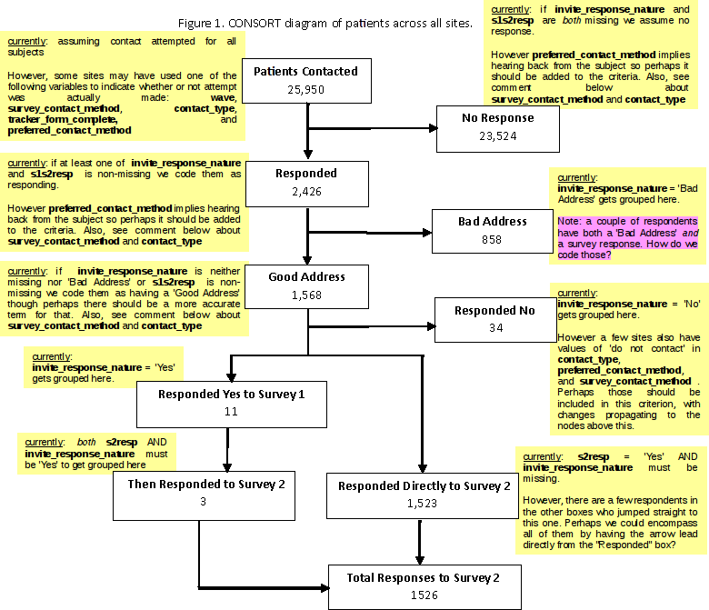

```{r, include=FALSE}
load('obesityPaper01.rdata');
require(magrittr); require(dplyr); require(knitr);
require(pander);
source('functions.R');
.gimme.formals <- formals(gimme);
formals(format.default)$big.mark <- ',';
knitr::opts_chunk$set(echo = FALSE,message=FALSE,warning=FALSE,results='asis');
```

```{r eval=FALSE}
# 
# READ ME !!! READ ME !!! READ ME !!! READ ME !!! READ ME !!! READ ME
# 
# Welcome to the source document from which the autoupdated_obesity_results 
# gets built (in combination with the data).
# 
# You don't need to be a programmer or a statistician to edit this! In fact, it's
# meant to be easier to work with because you don't need to worry about formatting--
# just write in plain text OUTSIDE the intervals that start with ```{r} and end
# with ``` (such as this one). Those contain code that inserts tables. There are
# a few other special characters here and there within the text. They too serve
# a purpose. If in doubt, leave them be. Please do not introduce formatting into 
# this document except colored highlights. Comments are also okay.
# 
# To start a new paragraph, leave an empty line. To create a header write a
# a line starting with a hash mark followed by a space (# ) and make sure that
# both the previous and subsequent lines are empty. To create a sub-header do
# the same thing but use two hash marks. To create italics put an asterisk on
# either side of a word or sentence. For bold text, use two asterisks. 
# 
# If you want to make sure a numeric value you're referencing gets auto-updated
# on the next revision, make that bold also. If you want to add a citation, make
# a pair of square brackets and put the DOI number inside them, or put the year,
# first author, journal, and the main words from the title if there is no DOI
# I'll put in the proper codes when I update.
# 
# I'm also happy to show you how to put in the correct codes yourself, if/when
# you are feeling ready. 
#
# -- Alex F. Bokov
# 
```

```{r notice}
cat(tb$notice);
```


# Abstract

**Objective:** The aim of this paper is to report on the initial obesity project from the Greater Plains Collaborative (GPC), a Clinical Data Research Network (CDRN) that is part of the Patient Centered Outcomes Research Institute (PCORI) National Patient Centered Clinical Research Network (PCORNet). 

**Materials and Methods:** The electronic health records of 10 academic medical centers in 8 Midwestern states were coordinated in order to allow for a prospective multi-site obesity focused research project to be conducted. A survey was designed to assess participant willingness for themselves, and their children (if appropriate) to participate in research, as well as the use of their health record data for research.The survey was composed of 7 questions regarding interest in medical research, as well as basic demographic and health related information. Each site had a goal of 1,000 initial positive survey responses and 100 completed surveys.
```{r}
formals(gimme)[c('the','modify','data','fromgroup')]<-alist(the='percent'
                                                            ,modify=pct
                                                            ,data=tb$dResComp
                                                            ,fromgroup='TRUE');
```
**Results:** A cohort of `r format(nrow(obd))` patients was created across the participating sites.  The eligible patient population was `r gimme(of='Sex',thats='Female')` female, `r gimme(of='Race',thats='Caucasian')` Caucasian, `r gimme(of='Financial.Class',thats='Self-Pay')` self-pay, with mean age of `r gimme('mean',of='Age',m=format,di=3)` (`r gimme('sd',of='Age',m=format,di=2)`) years with `r gimme(of='BMI',thats='Overweight')` overweight and `r gimme(of='BMI',thats='Obese')` obese. In general, a third of respondents had participated in research previously and were positive about being contacted for additional research both for themselves and for their children. Responses did vary by site.  

# PCORI, CDRNs, PCORI CDRN Obesity objectives/requirements

In 2013, The Greater Plains Collaborative (GPC) was established as Clinical Data Research Network (CDRN), funded by the Patient-Centered Outcomes Research Institute (PCORI) to securely collect and organize patient health information obtained during routine care in its member health systems {about PCORnet}. To date, 13 such CDRNS have been funded, creating a national “network of networks”. These networks are organized by a coordinating center and overseen by the National Patient-Centered Clinical Research Network (PCORnet) [@fleurence_launching_2014].

The purpose of CDRNs and PCORnet is to support efficient clinical research by creating centralized access to the de-identified data of millions of patients across the country. Each CDRN is responsible for harmonizing patient data across its member systems, and for creating streamlined governance and procedures to facilitate researcher access. Importantly, CDRNs actively involve a variety of stakeholders, including patients, clinicians, healthcare system leaders, and others to build and oversee CDRN activities

To test each CDRN’s ability to identify and recruit patients with a particular condition, and to test the ability to harmonize data elements within a network, each CDRN was required to create three cohorts: one of a common disease, one of a rare disease and one concerning height and weight.

## GPC & member sites, populations served

Placeholder text, map graphic?

In Phase I of funding, GPC was comprised of ten member health systems, with the data of roughly 6 million people across 7 states, north and south across the Great Plains region. Member institutions included University of Kansas Medical Center, Children’s Mercy Hospital (Kansas City, MO), University of Iowa Healthcare, University of Wisconsin - Madison, Medical College of Wisconsin, Marshfield Clinic, University of Minnesota, University of Nebraska Medical Center, University of Texas Health Science Center at San Antonio,  and University of Texas Southwestern Medical Center.

Covering more than 1300 miles, the broad reach of the GPC network encompasses large swaths of rural populations as well as multiple urban centers. Four systems in the GPC have established significant relationships with Native American populations. Two health systems located in Texas serve heavily Spanish-speaking populations, which had a significant effect on the healthy weight study approach and methods. Of the ten member health systems, all provide comprehensive adult and pediatric care, with the exception of Children’s Mercy Kansas City, which exclusively serves children.

In Phase II, largely following the work described in this paper, two additional members were added – University of Missouri and Indiana University.

------ ------------------------
&nbsp; Table 1, Survey Questions
       (placeholder)
-------------------------------

# Methods

## Healthy weight cohort team, organization of meetings, etc.

The healthy weight cohort team began regular meetings in January of 2014. Based on discussion and collective interest, the group quickly decided to develop its cohort and survey around a pediatric population. Weekly working group calls established an interest in characterizing the cohort around data elements that would be attainable for the nascent GPC network, and creating a survey that could be used as a building block for future GPC and healthy weight cohort work. Thus, the Health and Medical Research Family Survey (HMRFS) focused on respondents’ willingness to take part in research.

## IRB study protocol & aims, IRB deferral process

The overall purpose of the HMRFS was to conduct a demonstration survey across the 10 participating GPC sites focused on the topic of pediatric obesity. More specifically, the aims were to: 1) estimate the willingness of individuals to be contacted about research activities; 2) obtain information on the attitudes of parents and adults of child bearing age about research, including participation of their child/ren; 3) gain insight into participant attitudes about the use of gathered data for both local and national research; 4) explore the impact of various demographic factors, survey methods, regional variation, and weight status on the above questions. An additional expected outcome of the project was to understand the practical challenges and operational details of a large semi-interconnected system such as the GPC for conducting collaborative research focused on pediatric obesity.

Although previous studies have been published on adult obesity using a PCORI funded CDRN [@young_patient_2016], these studies were retrospective in nature reporting on the number of patients in the network who met certain criteria. In contrast, the GPC HWS not only gathered retrospective data on individuals who met certain specific inclusion criteria but also contacted a random group of individuals from this sub-sample at each site with a survey invitation. The goal for the 10 participating sites was to collect 1000 responses to “Survey 1” and 100 responses to “Survey 2.” Survey 1 was a single question asking whether or not the individual contact was willing to be contacted for research, and survey 2 was a more detailed assessment (see Table 1).

Through its efforts to streamline governance, the GPC IRB Consortium was established to facilitate IRB review and approval. The Consortium, including all the GPC sites, signed a common IRB reliance agreement and adopted standard operating procedures which would govern the reliance process. The University of Texas Health Science Center at San Antonio (UTHSCSA) served as the reviewing IRB site for the HMRFS across the GPC network. The HMRFS team of investigators and staff developed the necessary IRB documents which were submitted to the IRB at UTHSCSA. Once the documents were reviewed and approved by the reviewing IRB, the documents were shared with all other participating sites’ IRBs, and these documents were approved under the existing overall IRB reliance agreement. Currently, the GPC participates in the SMART IRB platform with over 175 participating institutions designed to facilitate multisite research and implement the NIH Single IRB Review Policy.  

------ ------------------------
&nbsp; Table 2, Eligibility Query
       (placeholder)
-------------------------------

## Natural experiment – variation in patient contacting methods

Individuals who were sent the survey invitation were contacted via a variety of means, including postal service, email, and through the patient portal feature of certain sites' electronic medical record systems (EMR). The method of contact was selected by each HMRFS site PI based on logistics and local policy requirements. Allowing each site to select their own contact method allowed for a natural experiment where recruitment rates and other factors are compared for different methods of contact. For a detailed list of site and contact method see Table 3. Different contact methods posed different challenges.  Traditional mail was costly in terms of staff time needed to validate addresses, stuff envelopes in addition to printing and postage costs. While mail would be sent in waves it was cheaper to send a larger sample all at once.  Sites doing email recruitment had difficulties with invalid or missing email addresses with some sites simply not having enough email addresses in the EMR to accrue a reasonable sample.  For most sites the eligibility cohort was selected from children's records but with the goal of contacting the parents. This raised the concern of whether the email truly belonged to the parent rather than to a child.  Sites were also affected by a time crunch secondary to IRB delays.   

```{r}
cat(tb$t03.sitemethod);
```

## IT mechanics, Patient selection & contact, I2B2

This study combined electronic chart review with the results of a survey administered to patients, or in the case of minors, to the patients’ guardians. For the electronic chart review, data was extracted from an open source data warehouse platform called Integrating Informatics from Bench to Bedside (i2b2) [@murphy_instrumenting_2009]. Each of the participating sites had an i2b2 instance deployed, where they stored a de-identified version of all structured data from their respective EMR systems. As a result, no site had to transmit any identifying information to any other site. 

Though not all the sites used the same type of EMR system, because of i2b2’s very flexible star-schema design the task of combining data from disparate sources was made more tractable. In fact, each site was completely autonomous in what software it used and how it organized its data internally as long as they had some means of running i2b2 queries. This decentralized, flexible approach is in keeping with the best practices of the sofware development field [@reference_forthcoming]-- "specify standards, not implementations". It would have been burdensome, expensive, and inappropriate stewardship of public research funds to impose a single vendor's database software on all participating sites. I2b2 itself does not have a vendor— it is a free, open-source product originally developed under an NIH grant [@reference_forthcoming]. Though the lead site at KUMC has an extract-transform-load (ETL) process for extracting data from the EMR, deidentifying it, and loading it into i2b2. This system, called HERON [@reference_forthcoming] was made available to all GPC sites but its use was not mandatory and only KUMC, UTHSCSA, and UNMC used it in its entirety. Most other sites adapted parts of it to their existing processes as needed.

The other required component besides i2b2 was REDCap [@harris_research_2009] or Research Electronic Data Capture. This is not an open source product but it is non-commercial software developed at Vanderbilt University for the purposes of conveniently capturing research data, especially surveys. All sites had their surveys on REDCap. At sites where paper and telephone responses were accepted, survey personnel manually filled in REDCap surveys on behalf of the respondents.

The survey data and the EMR data extracted from i2b2 could be merged together because each record is keyed to the same non-informative index across the two data sources.

Cohort selection was also done using i2b2, using the selection criteria shown in Table 3. Though GPC is currently deploying SHRINE [@referenece_forthcoming], at the time there was no query federation in place. The inclusion criteria had to be manually replicated at each site to the equivalent local codes. [placholder where I will write about how we came up with the criteria]. Once a query ran at a given site, that site's i2b2 server would generate a "patient set"-- a list of de-identified patient numbers. The informatics teams that run their respective i2b2 servers have crosswalk files matching the de-identified patient numbers to actual medical record numbers (MRN) or to database keys. Neither were shared externally, nor was there any reason to do so. The local informatics teams would use these identifiers to obtain names and contact information from their EMR systems. These contact lists were securely transmitted to the respective local HMRFS leads who uploaded them into REDCap and proceeded with recruitment. [placeholder to talk about the difficulties of using REDCap for purposes that are different from its intended use and the misconceptions surrounding what it's intended use actually is].

 It became necessary to send out a supplementary request to the study sites to acquire from their EMRs information about race, ethnicity, and class of insurance provider (private, Medicaid, employer, government, self-pay, etc.). Together with these data elements, information about income was requested. Since not all health systems record patient income, we had to rely on median household income for the census block group in which each patient’s address was located, as obtained from the 2013 American Community Survey [@reference_forthcoming].
 

```{r}
cat(tb$t04a.adultsites);
```

---

```{r}
cat(tb$t04b.pedsites);
```

## EHRs data extract, Patient reported outcome measures/Redcap Survey Data & Data Entry

Data was extracted from the EMR using DataBuilder [@adagarla_seine:_2015] collated into an analyzable tabular form using DataFinisher [@bokov_denormalize_2016]. Results of analyzing the combined survey and EMR datasets will be reported in a forthcoming paper [manuscript in preparation] 

## Survey collection methods – reasons driving choices. 

## Analysis plan

# Results



---

```{r}
cat(tb$t05.eligible);
```

...text omitted...

```{r}
cat(tb$t06a.eligBySite)
```

---

```{r}
cat(tb$t06b.resBySite);
```

---

```{r}
cat(tb$t06c.compBySite);
formals(gimme)[c('data')] <- alist(data=tb$dEligBySiteRange);
```


Sample size and demographics varied by site (Table 6a). Sample size by site varied from a maximum of `r gimme('max',thats='n',mo=format)` (`r gimme('whichmax',thats='n',mo=format)`) to a minimum of `r gimme('min',thats='n',mo=format)` (`r gimme('whichmin',thats='n',mo=format)`). The proportion of the cohort that was male at each site varied widely  from  `r gimme('max',thats='Sex=Male')`  to  `r gimme('min',thats='Sex=Male')`.  The  proportion  of  African  Americans  in  the  cohort  at  each  site  also  varied widely (`r gimme('max',thats='Race=African American')` - `r gimme('min',thats='Race=African American')`) as did the proportion of Native Americans (`r gimme('max',thats='Race=Native American')` - `r gimme('min',thats='Race=Native American')`) and the proportion of Asians (`r gimme('max',thats='Race=Asian')` - `r gimme('min',thats='Race=Asian')`). Insurance status type varied widely by site as well; the most common were self-pay (`r gimme('max',thats='Financial.Class=Self-Pay')` - `r gimme('min',thats='Financial.Class=Self-Pay')`),  Medicaid (`r gimme('max',thats='Financial.Class=Medicaid')` - `r gimme('min',thats='Financial.Class=Medicaid')`)  and  private  insurance  (`r gimme('max',thats='Financial.Class=Private Insurance')` - `r gimme('min',thats='Financial.Class=Private Insurance')`).  _Approximated  annual  income ranged from $40,000-70,000/year, and mean age for the target child ranged from 9.47 years –12.33. Three sites targeted adults as they  did not have children in their systems, and their average age was 36.15 (7.74) years  or 47.83  (15.1)  years.  Finally,  baseline  body  mass  index  (BMI)  for  the  participating  adult  individual  calculated from self-reported height and weight on the survey ranged from 20.30 (5.24) to 30.35 (7.27)._ Table 6b indicates these same variables by site for responders to Survey 1, and Table 6c indicates the same variables by site for Survey 2 respondents.

```{r}
.n01 <- sapply(tb$d02.rsamples,length);
```

## EHR Predictors of Participation

Prior to analysis the `r format(sum(.n01))` records were randomly assigned to a development (N=`r format(.n01['train'])`), 
validation (N=`r format(.n01['val'])`), and test subsets 
(N=`r format(.n01['test'])`) in order to avoid overfitting and bias due to within-sample testing. All analysis
decisions were made based on the developmental subset. The first
goal was to identify candidate predictors for survey participation from among the variables available for all  members of the cohort (i.e. those listed in Table 5). 

Accordingly, for each candidate predictor, a separate logistic regression model was fit to the developmental subset with responder
status as the outcome. Discrete variables with multiple levels were broken up into an equal number of indicator variables. This not only informed the decision of which predictor and random-effect variables but also in some cases how condense their levels. Table 8 shows the results of these `r length(tb$t07.univar) - 2` tests.
```{r}
cat(tb$t07.univar);
```

## HMRFS Survey

```{r, results='hide', echo=FALSE, message=FALSE, warning=FALSE}
formals(gimme)[c('the','modify','data','fromgroup','thats')] <- alist(the='percent',modify=pct,data=tb$dSurv,fromgroup='Overall',thats='TRUE');
```
`r gimme('n',of='age',mo=format)` individuals completed the HMRFS survey across all sites. Of these respondents, most self-reported as female (`r gimme(of='sex',thats='Female')`),  Caucasian  (`r gimme(of='White')`), and  having  private  insurance  (`r gimme(of='insurance',thats='Private')`). The modal range of self-reported household  income  was approximately $50,000-$100,000/year and average age was `r gimme('mean',of='age',m=format,di=3)` years with a baseline mean BMI of `r gimme('mean',of='a_bmi',m=format,di=4)` (`r gimme('sd',of='a_bmi',m=format,di=3)`). These data indicate the sample that responded to the HMRFS survey was similar to the overall cohort of eligible patients. Responses indicate that across all sites (Table 8a), `r gimme(of='research',thats='Yes')` of respondents had participated previously in medical research. Respondents were generally open to investigators contacting them about possible participation in studies (`r gimme(of='possible_research',thats='Yes')` yes; `r gimme(of='possible_research',thats='Maybe')` maybe). Key factors in making the decision to participate in medical research included: topic of research  (`r gimme(of='PR_Me_DependsAbout')`),  time  (`r gimme(of='PR_Me_Time')`),  doctor  recommendation  (`r gimme(of='PR_Me_Doctor_Op')`),  reimbursement  (`r gimme(of='PR_Me_Compensation')`), and child involvement (`r gimme(of='PR_Me_Involve_Child')`). Of respondents who  had  children  (`r gimme(of='children_in_home',thats='Yes')`), they  were  also  generally  positive  about possibly allowing their child to take part in medical research (`r gimme(of='children_research',thats='Yes',data=tb$dSurvHaveKids)` yes; `r gimme(of='children_research',thats='Yes',data=tb$dSurvHaveKids)` maybe) (Table 8b). The factors for deciding whether their children could participate in research followed the same order of priority as above. Most participants were in favor of their medical information being used for research (`r gimme(of='research_feeling',thats='Fantastic')` fantastic idea, `r gimme(of='research_feeling',thats='GoodIdea')` good idea) and even more so if the data being used for medical research is de-identified (`r gimme(of='deid_data',thats='Fantastic')` fantastic idea, `r gimme(of='deid_data',thats='GoodIdea')` good idea). 
```{r}
cat(tb$t08A.survresp);
```
---
```{r}
cat(tb$t08B.survrespkids);
```

# Discussion

## Lessons Learned

The goal of this experiment was to show whether and how we could use the electronic record across institutions to reach out to patients to answer research questions. Variation in some methodologies (such as method of contact) by site was allowed to facilitate the process and test various approaches the problem (a natural experiment).  Through this process we learned many lessons to be applied in the future.

## Different contact methods posed different challenges. 

For a detailed list of site and contact method see Table 3.

1. Traditional mail.  Traditional mail was costly in terms of staff time needed to validate addresses, stuff envelopes in addition to printing and postage costs. Mail surveys are traditionally sent in waves to the same sample with diminishing returns with each follow up.  The original design was then to send two to three contacts to each individual within stratified groups.  Then if certain group were not filled addition potential participants within that strata would be contacted. This process however was time consuming and costly.  When paying others to stuff and address envelopes, there were setup costs each time surveys were sent.  Thus it was cheaper and more expedient to send a larger sample all at once rather than smaller samples. As a result, some sites chose to send more survey initially to a larger sample rather than repeated survey to a smaller sample in order to get the sample number of responses. However, this has a negative effect on response rates with a larger denominator.  Incorrect addresses within the system remained a difficulty. 

2. Email.   Sites doing email recruitment had difficulties with invalid or missing email addresses.  Some sites simply did not have enough email addresses in the EMR to accrue a reasonable sample and thus chose to use traditional mail.  For most sites the eligibility cohort was selected from children's records but with the goal of contacting the parents. This raised the concern of whether the email belonged to the parent rather than to a child.

3. Contact from within the EMR (e.g. My Chart).   One site sent out messages inviting participants to connect to the survey through the electronic medical record (a form of secure email that is retained in the medical record).  This required many more levels of permission.  The institution initially said no. However it was the patient advisory board who got it approved as they believed the surveys were part of what should be done in a research institution. Potential benefits are that this form of communication is seen as more reputable and not likely to be dismissed as a phishing attempt.  However patients may not check their account in the medical record frequently and often lose their password if they have not been seen recent or used the system recently.

## Using a Central IRB  

## Obtaining data from the EMR – adapting to site differences

# Conclusion

# Supplementary Materials

```{r}
cat(tb$t0S1.eligByRecruit);
```

```{r}
cat(tb$t0S2.consort);
```
# References
